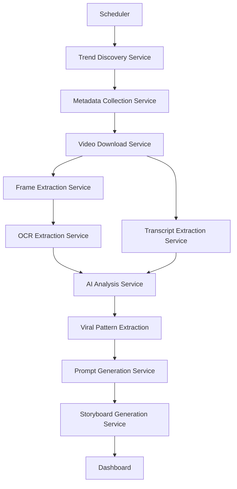

# Viral Reel Intelligence

The **Viral Reel Intelligence** application automatically discovers trending short-form videos, analyzes why they become viral, extracts reusable viral patterns, and generates ORIGINAL content prompts and storyboards inspired by those patterns, without recreating copyrighted content.

## Architecture Diagram



## Folder Structure

```text
viral-reel-intelligence/
├── backend/
│   ├── app/
│   │   ├── api/
│   │   ├── config/
│   │   ├── database/
│   │   ├── models/
│   │   ├── providers/
│   │   ├── repositories/
│   │   ├── schemas/
│   │   ├── services/
│   │   └── workers/
│   └── requirements.txt
├── frontend/
│   ├── src/
│   │   ├── app/
│   │   └── components/
│   └── package.json
└── docker-compose.yml
```

## Local Development Setup

While Docker is supported, the easiest way to develop locally is by running the frontend and backend directly.

### 1. Backend Setup (Python)

1. Navigate to the `backend/` directory:
   ```bash
   cd backend
   ```
2. Create and activate a virtual environment:
   ```bash
   python -m venv venv
   # Windows:
   venv\Scripts\activate
   # macOS/Linux:
   source venv/bin/activate
   ```
3. Install dependencies:
   ```bash
   pip install -r requirements.txt
   ```
4. Create a `.env` file in the `backend/` directory with your API keys. We use SQLite by default for local development:
   ```env
   # API Keys for Trend Discovery and AI Analysis
   YOUTUBE_API_KEY=your_youtube_api_key_here
   MISTRAL_API_KEY=your_mistral_api_key_here
   # Alternatively, if using Gemini:
   # GEMINI_API_KEY=your_gemini_api_key_here
   # AI_PROVIDER=GeminiProvider
   
   AI_PROVIDER=MistralProvider
   
   # Database configuration for local SQLite
   DATABASE_URL=sqlite:///./viral_reel.db
   ```
   
   > **Note on SQLite:** SQLite is configured by default for quick local setup. However, it does not support concurrent writes and is not suitable for production environments. For multi-developer or production scenarios, we strongly recommend using PostgreSQL.
5. Start the backend server:
   ```bash
   uvicorn app.main:app --reload
   ```
6. Access the API documentation at `http://127.0.0.1:8000/docs`.

### 2. Frontend Setup (Next.js)

1. Open a new terminal and navigate to the `frontend/` directory:
   ```bash
   cd frontend
   ```
2. Install dependencies:
   ```bash
   npm install
   ```
3. Start the development server:
   ```bash
   npm run dev
   ```
4. Access the Dashboard at `http://localhost:3000`.

## Docker Setup

Alternatively, you can run the entire stack using Docker Compose:

1. Ensure your `backend/.env` file is created and configured for Postgres:
   ```env
   # API Keys
   YOUTUBE_API_KEY=your_youtube_api_key_here
   MISTRAL_API_KEY=your_mistral_api_key_here
   AI_PROVIDER=MistralProvider
   
   # Database configuration for Docker Postgres
   # IMPORTANT: Replace 'your_secure_password' with a strong, randomly generated password.
   # Always store credentials securely and NEVER commit .env files to version control.
   DATABASE_URL=postgresql://postgres:your_secure_password@db:5432/viral_reel
   ```
2. Run:
   ```bash
   docker-compose up --build -d
   ```

## Configuration & Features

- **AI Providers**: The AI generation is abstracted via `AIProvider`. You can easily switch between models (Mistral, Gemini, etc.) by updating the `AI_PROVIDER` environment variable and providing the respective API key.
- **Database**: The application automatically creates all necessary database tables on startup. Local development uses SQLite by default to prevent complex PostgreSQL credential issues.
- **Hardware**: By default, `EasyOCR` is configured to run on the CPU to support machines without a GPU.
- **Subtitles**: Extracted via `yt-dlp` where possible to save transcription overhead.
- **Scheduled Workers**: The backend contains a background scheduler (using `apscheduler`) that can automatically poll for new viral trends.
