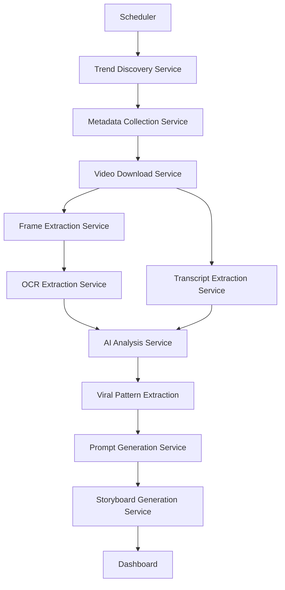

# Viral Reel Intelligence

The **Viral Reel Intelligence** application automatically discovers trending short-form videos, analyzes why they become viral, extracts reusable viral patterns, and generates ORIGINAL content prompts and storyboards inspired by those patterns, without recreating copyrighted content.

## Architecture Diagram



## Folder Structure

```
viral-reel-intelligence/
├── backend/
│   ├── app/
│   │   ├── api/
│   │   ├── config/
│   │   ├── database/
│   │   ├── models/
│   │   ├── providers/
│   │   ├── repositories/
│   │   ├── schemas/
│   │   ├── services/
│   │   ├── utils/
│   │   └── workers/
│   ├── alembic/
│   ├── Dockerfile
│   └── requirements.txt
├── frontend/
│   ├── src/
│   │   ├── app/
│   │   └── components/
│   ├── Dockerfile
│   └── package.json
└── docker-compose.yml
```

## Installation & Docker

1. **Clone the repository** (or navigate to the project directory).
2. **Set up API Keys**: Create a `.env` file in the `backend/` directory with the following keys:
   ```env
   GEMINI_API_KEY=your_gemini_api_key_here
   AI_PROVIDER=GeminiProvider
   DATABASE_URL=postgresql://postgres:password@db:5432/viral_reel
   ```
3. **Run via Docker Compose**:
   ```bash
   docker-compose up --build -d
   ```
4. Access the API at `http://localhost:8000/docs`.
5. Access the Next.js Frontend Dashboard at `http://localhost:3000`.

## Configuration

- The AI provider is abstracted via `AIProvider`. You can switch models by adding a new provider in `backend/app/providers/` and updating the `AI_PROVIDER` environment variable.
- Hardware: By default, `EasyOCR` is configured to run on CPU to support machines without a GPU.
- Subtitles are extracted via `yt-dlp` where possible to save transcription overhead.
